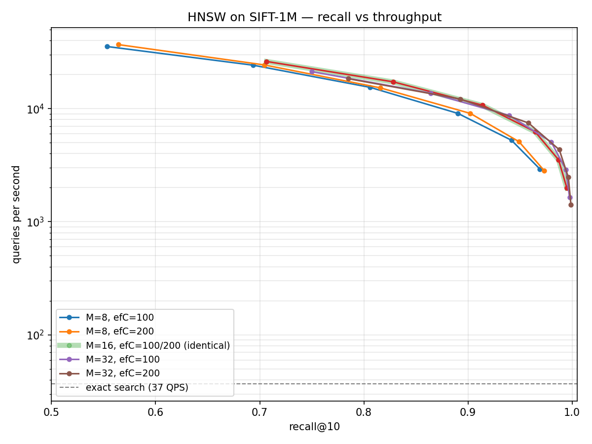
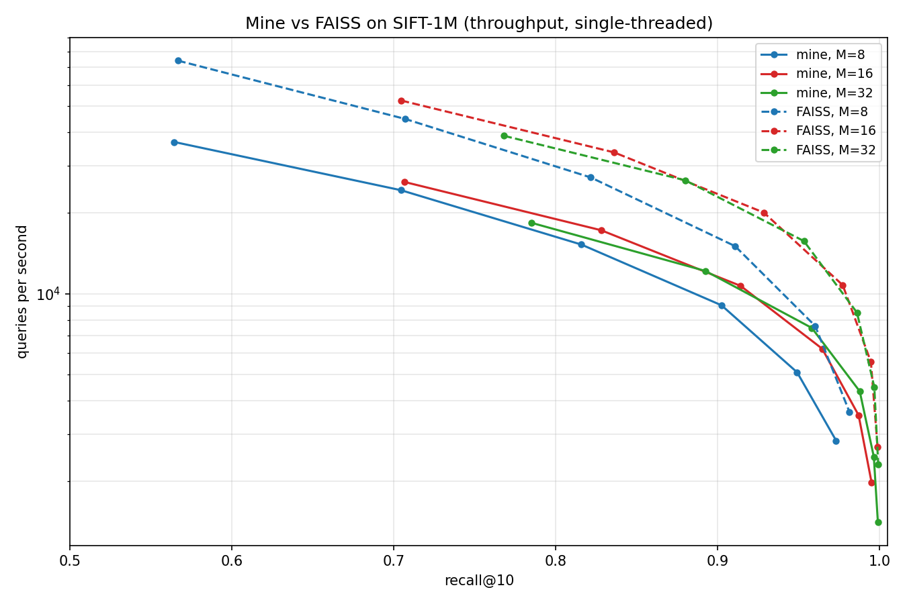
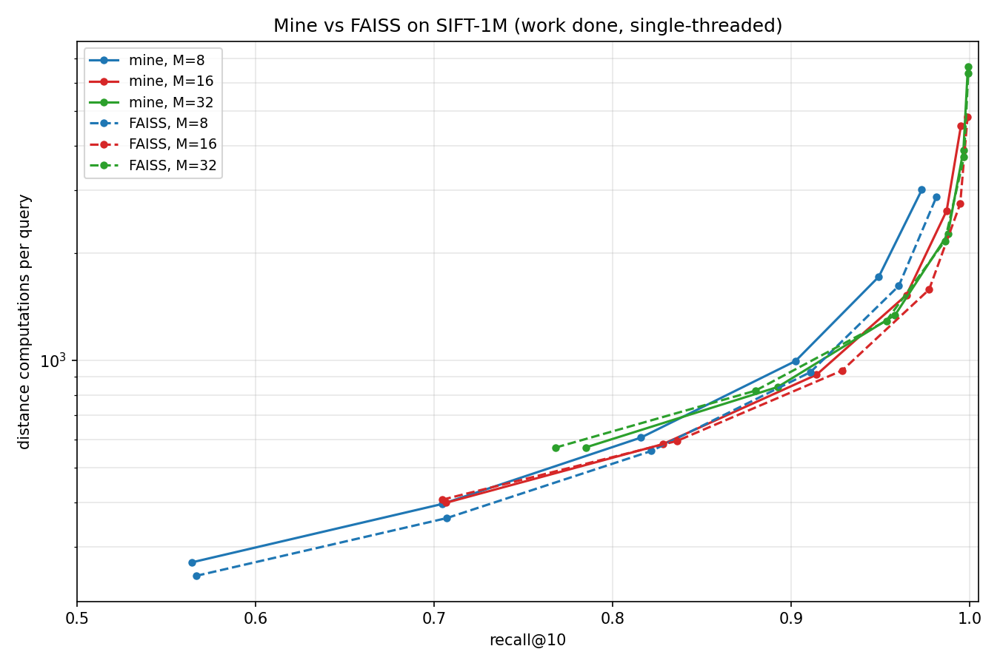

# Vector-Search


An approximate nearest neighbour index implemented from scratch in C, with a zero-copy Python binding. **95% recall@10 at 205 times the throughput of exact search on SIFT-1M**, scanning 0.13% of all vectors





The Pareto Plot above depicts the vector-search algorithm at different M (number of neighbouring nodes) and efConstruction (size of candidates/result arrays while constructing the graph) configurations, plotted against the brute-force algorithm.

### Results


Brute-force: 37 QPS, 1,000,000 distances/query

|     config    |             recall 0.9          |     recall 0.95            |   recall 0.99              |
|---------------|--------------------------------:|---------------------------:|---------------------------:|
|    M=8 efC=100|      8352 QPS   227x   1092 nd  |  4550 QPS   124x   2027 nd |            not reached     |
|    M=8 efC=200|      9227 QPS   251x    984 nd  |  5006 QPS   136x   1768 nd |            not reached     |
|   M=16 efC=100|     11725 QPS   319x    857 nd  |  7504 QPS   204x   1348 nd |   2948 QPS    80x   3344 nd|
|   M=16 efC=200|     11777 QPS   320x    857 nd  |  7526 QPS   205x   1348 nd |   2947 QPS    80x   3344 nd|
|   M=32 efC=100|     11327 QPS   308x    921 nd  |  7772 QPS   211x   1335 nd |   3504 QPS    95x   2886 nd|
|   M=32 efC=200|     11622 QPS   316x    899 nd  |  8042 QPS   219x   1278 nd |   3838 QPS   104x   2686 nd|


#### Comparison against FAISS





|      config  | recall |  mine QPS| FAISS QPS| ratio | mine nd  | FAISS nd | nd ratio|
|--------------|-------:|---------:|---------:|------:|---------:|---------:|--------:|
|         M=8  |   0.90 |    9227  |   16506  |  1.79x|   984    |    882   |  0.90x  |
|         M=8  |   0.95 |    5006  |   9128   |  1.82x|   1768   |    1474  |   0.83x |
|         M=8  |   0.99 |      -   |     -    |    -  |     -    |      -   |     -   |
|        M=16  |   0.90 |    11777 |   24260  |  2.06x|   857    |    830   |   0.97x |
|        M=16  |   0.95 |    7526  |   15967  |  2.12x|   1348   |    1220  |   0.91x |
|        M=16  |   0.99 |    2947  |   6946   |  2.36x|   3344   |    2438  |   0.73x |
|        M=32  |   0.90 |    11622 |   23536  |  2.03x|   899    |    950   |   1.06x |
|        M=32  |   0.95 |    8042  |   16196  |  2.01x|   1278   |    1270  |   0.99x |
|        M=32  |   0.99 |    3838  |    7006  |  1.83x|   2686   |    2738  |   1.02x |


The vector-search algorithm is 1.79-2.36 times slower than FAISS's algorithm at matched recall, single-threaded on identical data. At M= 16, 0.95 recall, my algorithm has QPS = 7,526 while FAISS has 15,967. Compared to brute force, vector-search is 80-320 times faster, depending on recall.


At M = 32, my algorithm has an nd of 899 vs 950 for FAISS (0.90 recall), 1278 vs 1270 (0.95 recall), and 2686 vs 2738 (0.99 recall). The work done is roughly equivalent while QPS differs by a factor of ~2. This can be attributed to cost of each individual distance computation rather than the algorithm. FAISS has hand-written SIMD intrinsics, prefetching of the next neighbour's vector boosting QPS. Vector-search relies on Clang's compiler auto vectorization (2.2 times scalar, measured by compiling with -fno-vectorize).


At M = 16 and 0.99 recall, my nd is 3344 vs 2438 for FAISS, a 37% difference. This extra computational cost can be minimized by adding a keepPrunedConnections function, which backfills the empty neighbour slots from rejected candidates. I measured mean layer 0 degree as 21 against a cap of 32. The additional function would help ensure each node is close to their M0 cap of 32 neighbours. Both implementations were compared single-threaded, since mine has no parallelism. Measured separately, FAISS's batch API with 10 threads reaches 51,046 QPS at recall 0.977 against its own single-threaded per-query 10,644 — a 4.7× gain, of which only ~2% comes from batching itself. Multi-threaded search is the largest single advantage FAISS holds and the one I did not implement; the sub-linear scaling (4.7× on 10 cores) reflects memory bandwidth contention, since HNSW search is bandwidth-bound over a 656 MB FAISS index.


## How it works

Given a set of 1,000,000 vectors, we must find the closest one to a given query. Exact search (brute force) compares against all vectors, always returns the correct answer at 37 QPS, taking 27 ms. Approximate nearest-neighbour search returns 95% of the right answers at 200 times the speed


Each vector is connected to M nearby ones, forming a graph. Every search starts at a specific entry point, and hops to the vector closest to the query. With a connected graph structure, each step checks ~M vectors rather than 1,000,000. At M = 16 and 0.95 recall, only 1348 distances were computed to find the 10 closest vectors to the query, at 95% accuracy; 0.13% of the entire collection


A regular greedy search always get stuck in a local minimum. Neighbouring nodes look worse, but the true answer is actually 2 nodes away. This was fixed by tracking ef (efSearch for queries and efConstruction to build the graph) candidate nodes (best unexplored nodes) alongside the best results found so far. This allows nodes that are currently worse to stay alive and explored later. ef is the accuracy/speed dial and can be changed per query without rebuilding.


Connecting each node to its M closest nodes fails as data forms clusters, stopping searches prematurely due to all M neighbours belonging to the same cluster. 50.3% of the graph was unreachable from the entry point, and recall capped at 0.665 regardless of ef. The solution is to reject a candidate that sits closer to an already selected neighbour than to the node itself, since the candidate is reachable through the neighbour. A direct edge would be redundant. As a result, edges are now longer, bridging clusters. Result: 99.9% of the graph is reachable, recall has a ceiling of 1.0.


A layered structure solves the issue of starting every search from the same entry point. Nodes further from the entry node took longer to reach due to long walks with short edges. Nodes are assigned to random layers, with each successive layer having 1/16th the previous. The bottom (0th) layer consists of all nodes. Sparsely populated upper layers with long edges cover large distances, while lower layers have higher precision. As a result, 47 distance computations were used for the descent from the topmost layer, with ~2x throughput at matched recall versus the flat graph.

## Project structure

```
src/         C implementation — vectors, distance, heap, graph, hnsw
include/     headers
tests/       C test suite, one binary per module
python/      ctypes wrapper and data loaders
benchmarks/  sweep harnesses, plotting, results
```


## Building

Requires `gcc` (or Clang), `make`, and Python 3.10+ with numpy.

```bash
make            # builds build/libvindex.so
make test       # builds and runs the C test suite
make clean
```

### Memory checking

valgrind has no Apple Silicon support, so memory checks run in a container:

```bash
docker build -f Dockerfile.test -t vindex-test .
docker run --rm -it vindex-test bash
# inside:
make test
for t in build/test_*; do valgrind --leak-check=full "$t"; done
```

## Data

SIFT-1M from the [TEXMEX corpus](http://corpus-texmex.irisa.fr/). Extract into
`data/`:

`data/`

`├── siftsmall/ # 10,000 vectors, for development`

`└── sift/ # 1,000,000 vectors, for benchmarks`


## Reproducing the benchmarks

```bash
pip install numpy matplotlib faiss-cpu

python benchmarks/sweep_sift1m.py    # builds 6 indexes (~20 min), sweeps efSearch
python benchmarks/faiss_compare.py   # same measurement against FAISS
python benchmarks/plot.py            # writes plots and tables
```

Indexes are cached in `data/indexes/` and the build phase skips anything
already present, so the sweep can be re-run without rebuilding.

Benchmark conditions: Apple Silicon, plugged in, low power mode off, `-O2`
with auto-vectorisation. 1,000 queries subsampled from the 10,000 provided.

## Design decisions

### C, not C++
- C does not offer built in data structures such as priority_queue and std::vector,
    which forces me to implement each from scratch
- C keeps function names as it is, allowing ctypes (python module) to find it. C++ scrambled them and would need extern wrappers
- Cost: ~250 extra lines, manual memory management
- C++ would be the better option for multi-threading or handwritten SIMD intrinsics


### numpy owns the vectors, C borrows a pointer
- Since numpy owns the vectors, storing 1M Vectors costs 512MB. 
- However, if C owned the vectors, copying per call would cost ~100ms to do 0.1ms of work
- The cost is that there are 2 crash modes: C freeing borrowed memory and Python garbage collecting an array C still points at. Prevented by the wrapper holding a reference


### Contiguous arrays, not pointer-per-element
- Applies to both the vector store and the graph adjacency
- Cache lines are 64 bytes and the prefetcher predicts sequential access;
  pointer-chasing costs ~100 cycles vs ~4
- A node's M=16 neighbour list is exactly one cache line
- Cost: fixed dimension, fixed M, manual index arithmetic

### Max-heap for finding the k smallest
- Max-heap stores the worst result in heap.peek(), allowing fo O(1) lookup time
- A min-heap surfaces the best keeper, which is never the question
- Beam search uses both: min-heap of candidates, max-heap of results

### Full-width layers
- Every layer allocates n slots regardless of membership
- Benefit: each layer is a graph, so every graph function works
  unmodified, and lookup is direct arithmetic with no indirection
- Cost: 380 MB of 544 MB is unused upper layer slots
- The alternative, priced: compact layers with a global-to-local ID map
  would recover ~340 MB for one extra memory read on the ~4% of distance
  computations that happen above layer 0

## Known limitations

- **No deletion.** Removing a node would leave dangling edges in every
  layer it appeared in; a tombstone-and-rebuild approach is the usual
  answer. Scoped out deliberately.

- **Single-threaded.** Both search and construction. Index construction is
  embarrassingly parallel across insertions and would be the first thing
  to thread.

- **380 MB of the 544 MB index is empty upper-layer slots.** See the
  full-width layer decision above; the compact alternative is priced there.

- **`keepPrunedConnections` not implemented.** The neighbour heuristic can
  select fewer than M neighbours when candidates are redundant; the paper
  back-fills from rejected candidates. Measured mean layer-0 degree is 21
  against a cap of 32, and at M=16 recall 0.99 this costs 37% more
  distance computations than FAISS.

- **Distance kernel relies on compiler auto-vectorisation**, not
  hand-written SIMD intrinsics. Measured at 2.2x over scalar; the gap to
  FAISS is roughly the same factor.

- **Serialisation format is not portable across architectures.** The index
  file is raw binary, assuming the reader matches the writer's endianness
  and `sizeof(int)`. True on every platform this runs on; portability would
  require byte-swapping every value on read and write.